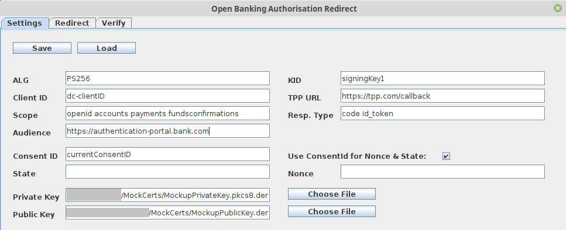
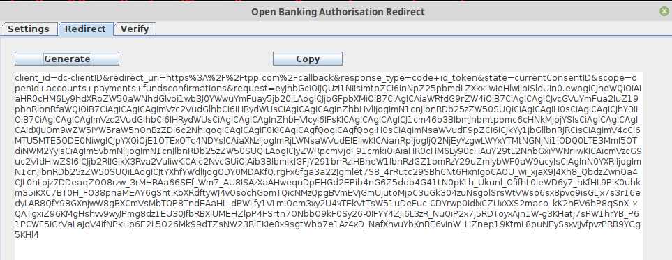
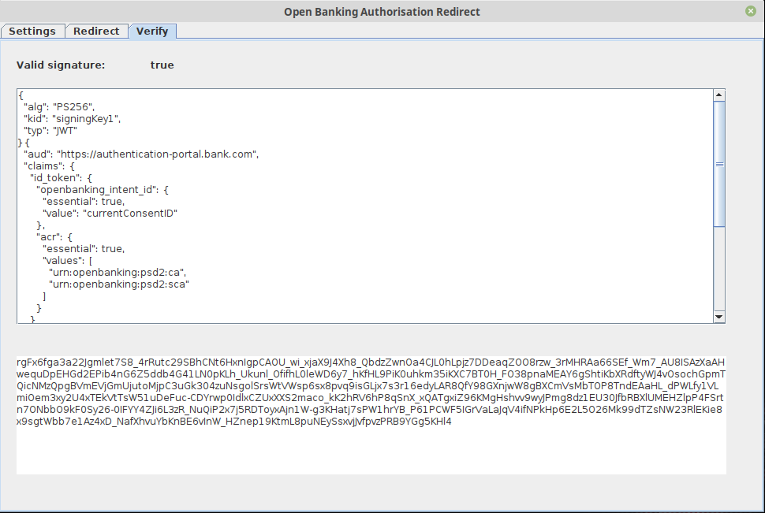

# Open Banking Authorisation Redirect

Implementation of the Open Banking authorisation redirect specification by Context Information Security.

This tool can be used to generate the GET request parameters for the end user redirect to their bank.

Here is a link to the specification: 

```
https://openbanking.atlassian.net/wiki/spaces/DZ/pages/83919096/Open+Banking+Security+Profile+-+Implementer+s+Draft+v1.1.2#OpenBankingSecurityProfile-Implementer'sDraftv1.1.2-HybridGrantParameters
```

(had to put the link in a code box, otherwise it was showing up broken)


The specification only lists the minimal requirements. Note, that ASPSPs can add additional parameters, therefore the tool may need to be adjusted to work for a specific bank.


Also refer to our tooling blog post series for an intro into Open Banking and Read/Write API tooling:

- Open Banking - Open for Business: https://www.contextis.com/en/blog/open-banking-open-for-business
- Open Banking Challenges: https://www.contextis.com/en/blog/open-banking-the-challenges
- Open Banking Read/Write API Tooling: https://www.contextis.com/en/blog/open-banking-read-write-api-tooling


## Requirements

This project requires 

- JDK 11 or higher
- Gradle 4 or higher
- Public and private key in DER format


## Build Project

The project can be build with gradle:

```bash
gradle clean
gradle build
```


## Run Project

```bash
java -jar OpenBanking-AuthorisationRedirect-v0.1.jar
```


## Feature Details

The redirect is normally generated by the TPP for each consent (authorisation request). For manual testing we need to take over this task ourselves. 

The TPP redirects the user to an endpoint specified by the bank, for example:

```
https://authentication-portal.bank.com/as/authorization.oauth2
```

The redirect has the following mandatory parameters:

| Parameter       | Info                                                         |
| --------------- | ------------------------------------------------------------ |
| `client_id`     | TPP client ID                                                |
| `redirect_uri`  | URL encoded TPP callback URL. After authorising the consent, the user is sent back to this URL. The redirect URL is set when the TPP registers with the Bank. |
| `response_type` | OAuth response type - default = `code id_token`              |
| `state`         | This is a random value. Some clients use the consent ID for this. |
| `scope`         | This is the scope for the bearer token. PISP = payments, AISP = accounts, CBPII = fundsconfirmations (openid is always set). The scope is initially decided with the OAuth bearer token that was used to create the consent ID. It should not be possible to add a bigger scope on the redirect. |
| `request`       | JWS - see example below                                      |

Example JWS structure:

```json
{
  "alg": "PS256",
  "kid": "<certificate signing key ID>",
  "typ": "JWT"
}
{
  "aud": "https://authentication-portal.bank.com",
  "claims": {
    "id_token": {
      "openbanking_intent_id": {
        "essential": true,
        "value": "<current consent id>"
      },
      "acr": {
        "essential": true,
        "values": [
          "urn:openbanking:psd2:ca",
          "urn:openbanking:psd2:sca"
        ]
      }
    }
  },
  "client_id": "<client id>",
  "exp": 1584438931,
  "iat": 1584438631,
  "iss": "<client id>",
  "jti": "<guid>",
  "nonce": "<random value - often consent id>",
  "redirect_uri": "https://tpp.com/callback",
  "response_type": "code id_token",
  "scope": "openid payments",
  "state": "<random value - often consent id>",
  "max_age": 86400
}
```

**Note**: The GET parameters are also included in the JWT and should be the same value. Otherwise the bank should reject the redirect request.


Below is an example request:

```http
GET /as/authorization.oauth2?client_id=dc-2ZqFDw5oqSkHQKXvvls1UL&redirect_uri=https%3A%2F%2Ftpp.com%2Fcallback&response_type=code+id_token&state=dff0696db6ec4d7b97ce4783f8ff1051&scope=openid+payments&request=<JWS> HTTP/1.1
Host: authentication-portal.bank.com
Accept: text/html,application/xhtml+xml,application/xml;q=0.9,image/webp,*/*;q=0.8


```

The extension generates the GET parameter as well as the JWS. We currently have a minimal working solution, meaning that this can be improved by for example automatically opening the redirect request in the browser instead of manually copying the params into the repeater tab.


### Settings

The image below shows the settings tab:




| Setting                         | Info                                                         |
| ------------------------------- | ------------------------------------------------------------ |
| ALG                             | Open Banking specifies either PS256 (preferred) or RS256. This may depend on the bank's implementation. |
| KID                             | Certificate Key ID                                           |
| Private Key                     | The absolute path to the private signing key in DER format.  |
| Public Key                      | Optional to verify the signing - The absolute path to the public signing key (not certificate) in DER format. |
| TPP URL                         | This is the Redirect URL for the TPP.                        |
| Client ID                       | This is the TPP identifier.                                  |
| Scope                           | The scope for the access request; PISP = payments, AISP = accounts, CBPII = fundsconfirmations; openid is always set. |
| Consent ID                      | The current consent ID. This value needs to be changed with every new consent. |
| Response Type                   | The response type for the authorised bearer token.           |
| State                           | This needs to be a random value, banks often use the consent ID |
| Audience                        | This is the redirect URL for the bank, where the user needs to authenticate to the bank and authorise the action. |
| Nonce                           | This needs to be a random value, banks often use the consent ID |
| Use ConsentId for Nonce & State | Tick this box, to use the consent ID for the Nonce and State fields. |

The public and private key fields require the absolute path to the key files in DER format. Below are some conversions for the public and private key as they are required for the tool.

- Public certificate in PEM format to public key in DER format:

```bash
# PEM certificate to PEM public key
openssl x509 -pubkey -noout -in cert.pem  > pubkey.pem

# PEM public key to DER public key: 
openssl rsa -pubin -inform PEM -in pubkey.pem -outform DER -out pub-key.der
```

- Private key in PEM format to private key in DER format:

```bash
openssl pkcs8 -topk8 -nocrypt -in signing.key -outform der -out priv-key.der
```


Please also see the example config file "open-banking-msg-redirect-config.json" provided with the repository. Note, that the path for the keys has not been added.


### Redirect

After entering all the settings, the redirect parameters can be generated. 




### Verify

The verify section allows the tester to double check the values in the JWS and to confirm whether the signature is valid.

